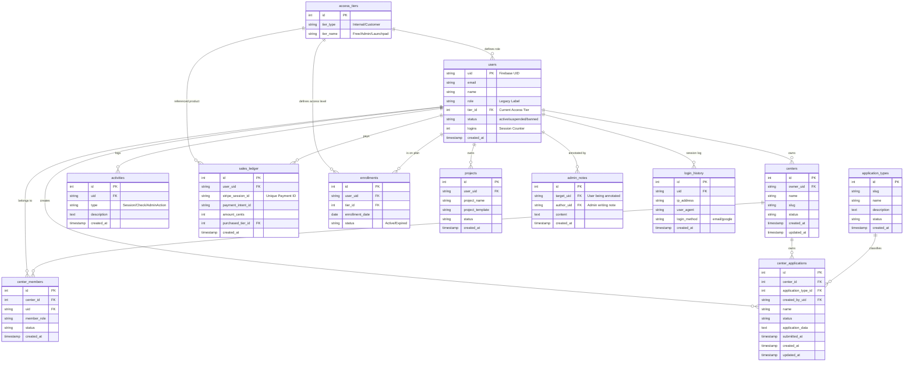

# CCBP DATABASE: SOURCE OF TRUTH (SOT)

This document is the **Absolute Blueprint** for the CCBP Portal database architecture. It defines the "Tiers of People," the center ownership model, the financial ledger, and the operational logs.

## 1. Entity-Relationship Diagram (ERD)



---

## 2. AI MANAGEMENT CRUD (Standard Operating Procedure)

This section defines how AI agents must manage the **Database Schema itself**.

### C - Create (New Migrations)
- **Standard**: If a new work session requires a schema change, CREATE a new sequential SQL file in the `database/migrations/` folder (e.g., `02_xyz.sql`).
- **Standard**: The filename must be prefixed with a 2-digit incrementing number.

### R - Read (Auditing State)
- **Standard**: Before proposing ANY change, the AI MUST read this `DATABASE_SOT.md` and all existing migration files.
- **Standard**: Always verify the "Documented SOT" against the "Live SOT" by running `DESCRIBE table_name` on the active MariaDB server.

### U - Update (Execution & Parity)
- **Standard**: EXECUTE the SQL migration against the MariaDB server via the approved SSH/Docker bridge.
- **Standard**: IMMEDIATELY update this `DATABASE_SOT.md` (diagram and dict) after execution to maintain 100% parity.

### D - Delete/Correct (Remediation)
- **Standard**: **NEVER** edit or delete a migration file that has already been run. 
- **Standard**: To fix a mistake, CREATE a new numbered "Remediation" SQL file (e.g., `03_remedy_last_change.sql`).

---

## 3. Data Dictionary & Access Logic

### A. The "Tiers of People" (`access_tiers`)
Access logic is governed by the `tier_id`.
- **Internal (1-2)**: 1=Admin, 2=Employee. Gives access to the Admin CRM/Analytics.
- **Customers (3-6)**: 3=Free, 4=Launchpad, 5=Director, 6=Ceo Circle. Governs the tools and business plans available.

### B. Centers (`centers` & `center_members`)
The system is now designed around the **center as the primary business entity**.
- A `center` is the daycare business, location, or operational entity.
- A user can create a center and become its owner.
- Additional users connect to that center through `center_members`.
- Shared operational data should increasingly attach to `center_id`, not only `uid`.

### C. Center Applications (`application_types` & `center_applications`)
Centers can own multiple application workflows.
- `application_types` defines the application classes available to centers.
- `center_applications` stores center-scoped application records such as enrollment, waitlist, or employment workflows.
- Application state is tracked independently of individual user accounts.

### D. Monetization & Access (`sales_ledger` & `enrollments`)
- Every transaction is recorded in the **Sales Ledger**.
- Upon payment success, an **Enrollment** is created. 
- The **Enrollment** table is the active check for plan status.
- `sales_ledger`, `enrollments`, and `projects` now support an optional `center_id` ownership layer.

### E. Operational Audit (`activities`)
- Every dashboard entry increments `users.logins`.
- Significant actions are logged to `activities` for "Proof of Life" tracking.
- Activity types: `Session` (auto on login), `Check` (manual test), `AdminAction` (tier/status changes by admin).

### F. Admin CRM (`admin_notes`)
- Internal-only annotations per user.
- Written by admins (author_uid), attached to users (target_uid). 
- Visible only in the Admin Dashboard detail panel.

### G. Login Audit Trail (`login_history`)
- One row per portal session.
- Recorded automatically by `DashboardContent.tsx` `trackSession()` on each new session.
- Fields: uid, user_agent, login_method (email/google), timestamp.
- IP address column exists but is NULL from frontend — requires portal-api middleware to capture (future).

### H. Database Explorer (Admin Only)
- Full dynamic CRUD/DDL on any table in the MariaDB instance.
- Uses `_tables`, `_schema`, and `_ddl` endpoints to discover and mutate schema.
- Primary tool for ad-hoc data correction and table management.

---

## 4. Service Architecture (Server: 150.136.42.8)

```
┌─────────────────────────────────────────────────────────┐
│  OCI Server (150.136.42.8)                              │
│                                                         │
│  ┌──────────────┐  ┌──────────────┐  ┌──────────────┐  │
│  │  portal-api   │  │  stripe      │  │  claims-api   │  │
│  │  port 4000    │  │  port 3000   │  │  port 4100    │  │
│  │              │  │              │  │              │  │
│  │  DB Mirror   │  │  Payments    │  │  Firebase    │  │
│  │  (MariaDB)   │  │  (Stripe)    │  │  Claims Mgmt │  │
│  └──────┬───────┘  └──────┬───────┘  └──────┬───────┘  │
│         │                 │                 │          │
│         ▼                 │                 ▼          │
│  ┌──────────────┐         │          ┌──────────────┐  │
│  │  MariaDB     │◄────────┘          │  Firebase    │  │
│  │  (SOT Data)  │                    │  Auth (SOT   │  │
│  │              │                    │  Access)     │  │
│  └──────────────┘                    └──────────────┘  │
└─────────────────────────────────────────────────────────┘
```

### Service Responsibilities (Single Responsibility Principle)
| Service | Port | Job | Talks To |
|:---|:---|:---|:---|
| `portal-api` | 4000 | Mirror MariaDB for the frontend (CRUD + DDL) | MariaDB |
| `stripe` | 3000 | Process Stripe payments, update DB tiers | MariaDB + Stripe |
| `claims-api` | 4100 | Stamp roles into Firebase tokens | Firebase Auth |

### Firebase Custom Claims Flow
When a user's role changes in MariaDB, the `claims-api` must be called to sync that role into Firebase:

1. **DB Updated** (e.g., Stripe payment upgrades `tier_id`)
2. **claims-api called**: `POST /api/v1/set-claims { uid, role, tierId }`
3. **Firebase stamped**: `admin.auth().setCustomUserClaims(uid, { role, tierId })`
4. **Frontend refreshed**: `user.getIdToken(true)` pulls new token with claims
5. **UI updates**: Auth store reads `tokenResult.claims.role` → renders correct nav

### claims-api Endpoints
| Method | Path | Body | Purpose |
|:---|:---|:---|:---|
| POST | `/api/v1/set-claims` | `{ uid, role, tierId }` | Stamp role into token |
| GET | `/api/v1/get-claims/:uid` | — | Read current claims |
| POST | `/api/v1/sync-claims` | `{ users: [{uid, role, tierId}] }` | Bulk sync |

---

## 5. Maintenance Protocols
- **No Ad-Hoc SQL**: All schema changes must follow the Management CRUD rules above.
- **portal-api is a Mirror**: Do NOT add business logic to it. It reflects the DB and nothing more.
- **claims-api syncs Access**: Whenever a role/tier changes in MariaDB, claims-api MUST be called to keep Firebase in sync.
- **stripe is Payments Only**: Do NOT add non-payment logic to the Stripe service.

---

## 6. Global Auth Lifecycle: The Synchronization Chain

This section explains how Identity (Firebase), access (MariaDB), and center ownership work together in a multi-stage process.

### Stage 1: Identity & Establishment
When a user signs up or logs in through `AuthModal.tsx` or `LoginForm.tsx`, the **Firebase Client SDK** establishes their basic Identity. This is strictly a "Who are you?" check.

### Stage 2: Access Tier Verification (DB Truth)
The portal reads the user's `tier_id` from the MariaDB `users` table via the `portal-api`. This is the **Source of Truth** for their actual permissions.
- Tier 1-2 = Admin / Internal
- Tier 3-6 = Customer Tiers

### Stage 2B: Center Context
After identity is established, the portal loads the user's connected centers through `center_members`.
- A first-time user may create a new center.
- A returning user may belong to one or more centers.
- Shared portal workflows should operate in the context of the active `center_id`.

### Stage 3: The Custom Claim "Stamp" (`claims-api`)
To prevent making a database request on every single page load, we use **Firebase Custom Claims**. 
- Whenever a user's tier changes (Stripe payment, sign-up, or Admin update), the `claims-api` (Port 4100) is called.
- It "stamps" the `role` and `tierId` into the user's server-side Firebase record.
- **Backend Code**: `admin.auth().setCustomUserClaims(uid, { role, tierId })`

### Stage 4: Reactive Token Refresh
The frontend `authStore.ts` listens for auth state changes. To ensure the client instantly sees new claims, it forces a token refresh:
- **Code**: `const tokenResult = await user.getIdTokenResult(true);`
- This ensures the `tierId` is pulled from the token and stored in NanoStores, allowing the UI to gate navigation reactively.

---

## 7. Dashboard & Component Development Standards

To keep the "Antigravity Premium" design and prevent broken dashboards, follow these coding laws:

### Law 1: No Raw SQL on Frontend
NEVER use `portalApi.query("RAW SQL HERE")` inside a React component. It is fragile and bypasses the stable API routing.

### Law 2: The "REST & Join" Pattern
Dashboards must fetch tables individually and join them in React state.
**Correct Implementation Pattern:**
```typescript
const [users, tiers] = await Promise.all([
    portalApi.get('/v1/users'),
    portalApi.get('/v1/access_tiers')
]);

const joinedData = users.map(u => ({
    ...u,
    tier_name: tiers.find(t => t.id === u.tier_id)?.tier_name || 'Member'
}));
```

### Law 3: Reactive Gating (Tier Benchmarks)
Hide/Show UI elements using the `tierId` Benchmark.
- Use `{user?.tierId <= 2 && <AdminLink />}` for management tools.
- Use `{user?.tierId >= 4 && <PremiumTool />}` for customer features.

### Law 4: No `window.location.reload()`
After any database write, update React state by refetching the affected data via `portalApi.get()`. Never force a full page reload. The user should see the change appear reactively in the existing component.

### Law 5: Manifest-First Schema Workflow
All schema changes follow this exact order:
1. Write a numbered migration SQL file in `database/migrations/`.
2. Update `01_create_manifest.sql` baseline to include the change.
3. Run the migration on production.
4. Update this `DATABASE_SOT.md` (ERD + dictionary).
5. Only then build the frontend component that uses the new schema.
Never SSH into the database and run ad-hoc ALTER TABLE commands.

---

## 8. Scaling System Data (Adding New Entries)

When adding new tools, business plans, or tiers, follow this exact workflow:

### A. Update the Database Manifest
1. Create a new numbered migration (e.g., `03_add_new_tier.sql`).
2. Update the `access_tiers` table with the new entry.
3. Update the `users` table with the corresponding `tier_id`.

### B. Sync the Access Claims
1. Call the `claims-api` to sync the new `tier_id` into the user's Firebase token.
2. The user will see the update on their next hard-refresh or login via the `getIdTokenResult(true)` logic.

### C. Extend the UI
1. Add the new navigation link to `sidebarNavContent.tsx`, `UserNav.tsx`, and `MobileNav.tsx`.
2. Wrap the new link in a tier check matching the database entry.
